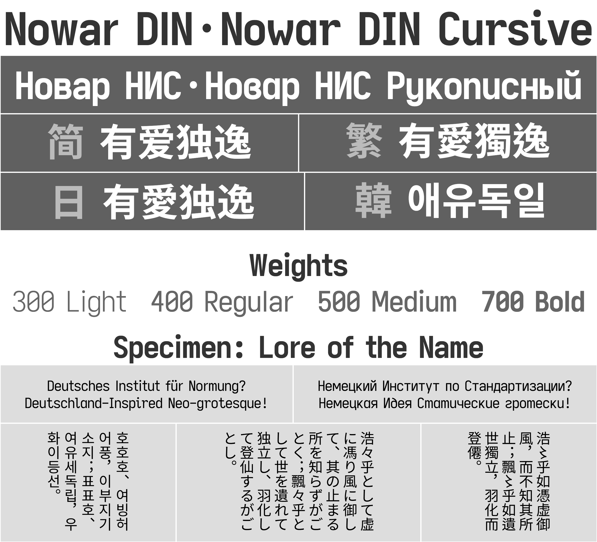

[English](README.md) **简体中文** [繁體中文](README-Hant.md)

# 有爱独逸 · 有爱独逸手写体

有爱独逸和有爱独逸手写体是具有 DIN 字体设计风格的《魔兽世界》和《魔兽世界：经典怀旧服》字体包，支持所有客户端语言。

> 浩々乎如憑虚御風 
> 飄々乎如遺世獨立

## 下载指南

[GitHub 上的最新版](https://github.com/nowar-fonts/Nowar-DIN/releases)

镜像：[Gitee](https://gitee.com/nowar-fonts/Nowar-DIN)

有爱独逸和有爱独逸手写体分别有 4 种字重和 5 种地区变体，此外还各提供了 1 个预编译的特性变体。

### 字重

* 300：细体
* 400：常规
* 500：中等
* 700：粗体

### 地区变体

Bliz 和 Neut 是 “标准变体”，遵循各地区的字形标准。

|      | 西文和韩国语 | 简体中文     | 繁體中文 | 备注                            |
| ---- | ------------ | ------------ | -------- | ------------------------------- |
| Bliz | 中国大陆字形 | 中国大陆字形 | 台湾字形 | 遵从《魔兽世界》默认字体设置。  |
| Neut | 传统字形     | 中国大陆字形 | 台湾字形 | 未指定字形标准时，采用传统字形。|

CL 是 “传统变体”，采用传统印刷字形（即康熙字形）。

|    | 所有语言 |
| -- | -------- |
| CL | 传统字形 |

PSimp、PSimpChat 是特殊的变体，针对使用繁体中文客户端，但更喜欢简化字的玩家，把繁体字重映射为简化字字形。

|           | 繁体中文相关的非聊天字体 | 繁体中文聊天字体      | 西文、简体中文、韩国语 |
| --------- | ------------------------ | --------------------- | ---------------------- |
| PSimp     | 中国大陆字形（重映射）   | 中国大陆字形          | 不可用                 |
| PSimpChat | 中国大陆字形（重映射）   | 中国大陆字形（重映射）| 不可用                 |

* 西文：英语、西班牙语（拉丁美洲）、葡萄牙语、德语、西班牙语（欧洲）、法语、意大利语、俄语。
* 繁体中文相关的字体包括 `FRIZQT__` 和 `ARIALN`。某些插件硬编码了此字体。

### 特性

| 标记 | 名称        | 简介                                              |
| ---- | ----------- | ------------------------------------------------- |
| OSF  | Oldstyle    | 不齐线、等宽的旧式数字。                          |
| RP   | Roleplaying | `丶`（U+4E36）重映射为 `·`（U+00B7，MIDDLE DOT）。|

预编译的特性变体：`Bliz,OSF`。
